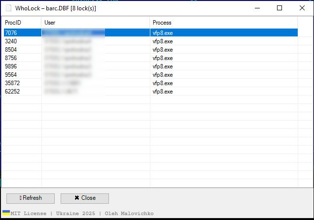

# WhoLock
---
WhoLock
Show who locked the file.
The utility shows who locked the file.
Tested on Windows Server 2022 Standard
Work only with administrator rights.
---
Important
Before using — run the utility .\Sysinternals\handle.exe once.  
Edit the path to the utility in the .\RegMenu\menu_all.reg file.
Run menu_all.reg — this adds the utility to the right-click context menu (File Explorer).
Or
1. Run lockedfile.cmd  
2. Select the locked file  
---

 

 

Or another example of a command line utility:
See who opened a file:
openfiles /query /fo table /v

Or filter by part of the path/name:
openfiles /query | findstr "file_name"

Example:
openfiles /query | findstr "report.dbf"

------------------------------------------------------------------------------------

Ukraine
============================
WhoLock
Вивести хто заблокував файл.

Важливо:
Перед використанням запустіть утиліту .\Sysinternals\handle.exe один раз.
Відредагуйте шлях до утиліти у файлі .\RegMenu\menu_all.reg.
Запустіть menu_all.reg — це додасть утиліту до контекстного меню, яке викликається  правою кнопкою миші на файлі (File Explorer).

===========================
1. Запустити lockedfile.cmd 
2. Вибрати заблокований файл файл 
============================

============================
Приклад іншої утіліти з командної строки:
============================

Подивитися, хто відкрив файл
openfiles /query /fo table /v

Або відфільтрувати по частині шляху/імені:
openfiles /query | findstr "назва_файлу"

Наприклад:
openfiles /query | findstr "report.dbf"

---
Oleh Malovichko
